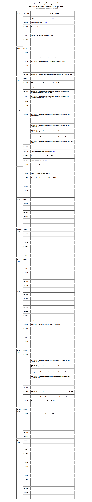

МИНИСТЕРСТВО НАУКИ И ВЫСШЕГО ОБРАЗОВАНИЯ РОССИЙСКОЙ ФЕДЕРАЦИИ 

ФЕДЕРАЛЬНОЕ ГОСУДАРСТВЕННОЕ БЮДЖЕТНОЕ ОБРАЗОВАТЕЛЬНОЕ 

УЧРЕЖДЕНИЕ ВЫСШЕГО ОБРАЗОВАНИЯ 

«ВЯТСКИЙ ГОСУДАРСТВЕННЫЙ УНИВЕРСИТЕТ» 

Институт математики и информационных систем 

Факультет автоматики и вычислительной техники 

Кафедра систем автоматизации управления 

 

 

 

 

 

 

 

 

 

<b>Изучение методов формирования html</b> 

Отчет по лабораторной работе № 1 

по дисциплине 

Основы frontend-разработки и организации человеко-машинного интерфейса 

Вариант № 2 

 

 

 

 

 

 

Выполнил студент гр. ИТб-1301-01-00 _________________ /Морозов И.В./ 

Руководитель ст. преподаватель _________________ /Земцов М.А./ 

 

 

Киров 2021

 

 

 

Цель лабораторной работы: изучение методов формирования html5 документов на стороне клиента. 

 

Задачи лабораторной работы: 

<ol><li>Организовать рабочее пространство и процессы разработки html5 документов.</li>

<li>Изучить структуру html5 документа</li>

<li>Исследовать функциональные возможности инструментов разработчика на стороне браузера</li>

<li>Изучить типовые элементы структуры html5 документа</li>

<li>Составить отчет по выполненным задачам</li>

<li>Защитить лабораторную работу</li></ol>
 
<h3>Ход работы</h3>
 
<h4>Задание 1</h4>

Создайте HTML-страницу index4.html, разделенную на фреймы в соответствии с номером варианта (Рисунок 1). В качестве заголовка страницы используйте ваше имя, отчество и фамилию. Фреймы должны содержать:

№1 – номер зачетной книжки;

№2 – таблицу (рис.2);

№3 – ваше имя, отчество и фамилию;

№4 – список дисциплин и преподавателей текущего семестра

 

</a>

Рисунок 1 – Таблица по заданию 1

</a>

Рисунок 2 – Таблица ячейки № 2

 

Web-страница, созданная в соответствии с первым заданием, представлена на рисунке 3.

 

</a>

Рисунок 3 – Реализация задания 1

 

После реализации набора html страниц была проведена валидация результатов с помощью       [валидатора](https://validator.w3.org/#validate_by_input/) .

Подтверждение успешной валидации результата представлено на рисунке 4

 

</a>

Рисунок 4 – Валидация результата 

 

 Листинг базовой страницы index4.html представлен в приложении А.

 
<h4>Задание 2</h4>

Создайте файл index.html, используя html5 разметку. Файл должен реализовывать предыдущее задание с использованием языка html5.

Web-страница, созданная в соответствии со вторым заданием, представлена на рисунке 5.

 

</a>

Рисунок 5 – Web-страница по заданию 2

 

После реализации набора html страниц была проведена валидация результатов с помощью [валидатора](https://html5.validator.nu/) .

Подтверждение успешной валидации результата представлено на рисунке 6

 

</a>

Рисунок 6 – Валидация результата 

 

 Листинг базовой страницы index.html представлен в приложении Б.

 

Выводы по эволюции стандарта html5 и принципов преобразования документов из стандарта html 4 в версию 5:

В стандарте html 5 большинство используемых в HTML 4.01 атрибутов было удалено. Разделение элементов на блочные и строчные используется в спецификации HTML до версии 4.01. В HTML5 эти понятия заменены более сложным набором категорий контента, согласно которым каждый HTML-элемент должен следовать правилам, определяющим, какой контент для него допустим. Главным отличием стандарта html 4 от стандарта html 5 заключается в том что стандарт html 5 ориентирован в большей степени на работу в связке с css, а стандарт html 4 более самостоятелен.

 

Задание 3  Прочитайте про теги разметки текста. Описание тегов приведено по ссылке: https://html5book.ru/html-text/. 

По результатам ответьте на следующие вопросы:

    <ol><li>Какие из тегов являются тегами форматирования абзацев?</li>
    <li>В чем различие тегов h?</li>
    <li>Для чего применяется тег code как его использовать?</li>
    <li>В чем различие тегов code, kbd, samp, var, pre?</li>
    <li> В чем отличие тегов оформления цитат и определений от тегов обычного форматирования текста?</li>
    <li>Для чего применяются теги p, br и hr?</li>
    <li>Какая разница в тегах span и p?</li>
    <li>В чем разница между тегами b и strong?</li></ol>

 

Ответы на вопросы:

    <ol><li>Теги p, br, hr.</li>
    <li>Теги h иерархичны, так тег h1 – заголовок самого верхнего уровня, а h6 – заголовок шестого самого нижнего уровня.</li>
    <li>Тег code предназначен для отображения одной или нескольких строк текста, который представляет собой программный код. Браузеры обычно отображают содержимое контейнера code как моноширинный текст уменьшенного размера. Синтаксис <\code>текст</> .</li>
    <li>Тег kbd выделяет текст, который должен быть введён пользователем с клавиатуры. Тег samp используется для вывода текста, представляющего результат выполнения программного кода или скрипта, а также системные сообщения. Тег var выделяет переменные из программ, отображая их курсивом. Тег pre выводит текст без форматирования, с сохранением пробелов и переносов текста.</li>
    <li> Теги оформления цитат и определений предназначены для выделения аббревиатур, длинных и коротких цитат, источника цитат, что значительно упрощает процесс формирования html страницы.</li>
    <li>Данные теги применяют для разделения текста. Тег p определяет текстовый абзац. Тег br предназначен для переноса текста на новую строку. Тег hr создает горизонтальную линию для тематического разделения параграфов.</li>
    <li>Тег span предназначен для определения строчных элементов документа. В отличие от блочного элемента p, с помощью тега span можно выделить часть информации внутри других тегов и установить для нее свой стиль.</li>
    <li>Тег b как и тег strong выделяет текст полужирным, но не придает ему важности.</li></ol>

 
<h4>Задание 4</h4>

Используя методы разметки текста реализуйте текущее расписание занятий на 2 недели. При реализации необходимо чтобы ссылки на онлайн лекции были меньше и выделены жирным курсивом, фамилия преподавателя была курсивом, а название дисциплины было h4. Использованием стилей недопустимо.

Расписание, реализованное на HTML-странице, представлено на рисунке 7.

 

</a>

Рисунок 7 – Расписание на 2 недели

 

 Вывод: в ходе работы были изучены типовые элементы структуры html документов и получены навыки в их формировании. Также были исследованы функциональные возможности инструментов разработчика на стороне браузера и язык разметки markdown.

 

Приложение А

(обязательное) 

Листинг базовой страницы index4.html

    
    <!DOCTYPE HTML PUBLIC "-//W3C//DTD HTML 4.01 Frameset//EN" "http://www.w3.org/TR/html4/frameset.dtd">
    <html>
    <head>
    <meta http-equiv="Content-Type" content="text/html; charset=utf-8">
    <title>Табличка на четверке</title>
    </head>
    <frameset rows = "610, *">
    <frameset cols = "770, *">
        <frame SRC = "i4-№2.html" name="табличка">  
        <frameset rows = "222, *">
        <frame SRC = "i4-№1.html" name="студень">
        <frame SRC = "i4-№4.html" name="преподы">
        </frameset>    
    </frameset>
        <frame SRC = "i4-№3.html" name="ФИО">
    <noframes>
        Sorry, there is not a frame support in your browser.
    </noframes> 
    </frameset>
    </html>
 

Приложение Б

(обязательное) 

Листинг базовой страницы index.html

    <!DOCTYPE html> <!-- Объявление формата документа -->
    <html>
    <head> <!-- Техническая информация о документе -->
    <meta charset="UTF-8"> <!-- Определяем кодировку символов документа -->
    <title>Табличка на пятерке</title> <!-- Задаем заголовок документа -->
    <link rel="stylesheet" type="text/css" href="style.css"> <!-- Подключаем внешнюю таблицу стилей -->
     <!-- Подключаем сценарии -->
    </head>
    <body>
    <table>
        <tr>
            <td rowspan=2><iframe src="№2.html" height="612" width="820"></iframe></td>
            <td><iframe src="№1.html" height="220" width="820"></iframe></td>
        </tr>
        <tr>
            <td><iframe src="№4.html" height="380" width="820"></iframe></td>
        </tr>
        <tr>
            <td colspan=2><iframe src="№3.html" height="280" width="1650"></iframe></td>
        </tr>
    </table>
    </body>
    </html>