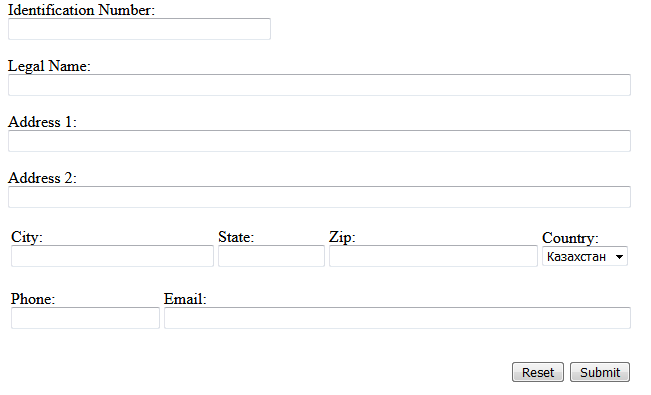

МИНИСТЕРСТВО НАУКИ И ВЫСШЕГО ОБРАЗОВАНИЯ РОССИЙСКОЙ ФЕДЕРАЦИИ 

ФЕДЕРАЛЬНОЕ ГОСУДАРСТВЕННОЕ БЮДЖЕТНОЕ ОБРАЗОВАТЕЛЬНОЕ 

УЧРЕЖДЕНИЕ ВЫСШЕГО ОБРАЗОВАНИЯ 

«ВЯТСКИЙ ГОСУДАРСТВЕННЫЙ УНИВЕРСИТЕТ» 

Институт математики и информационных систем 

Факультет автоматики и вычислительной техники 

Кафедра систем автоматизации управления 

 

 

 

 

 

 

 

 

 

<b>Изучение методов формирования html</b> 

Отчет по лабораторной работе № 2 

по дисциплине 

Основы frontend-разработки и организации человеко-машинного интерфейса 

Вариант четный 

 

 

 

 

 

 

Выполнил студент гр. ИТб-1301-01-00 _________________ /Морозов И.В./ 

Руководитель ст. преподаватель _________________ /Земцов М.А./ 

 

 

Киров 2021

 

 

 

Цель лабораторной работы: изучение методов формирования html5 документов на стороне клиента. 

 

Задачи лабораторной работы: 

<ol><li>Организовать рабочее пространство и процессы разработки html5 документов.</li>

<li>Изучить типовые блочные элементы html5 документа</li>

<li>Изучить типовые элементы построения форм html5 документа</li>

<li>Выполнить самостоятельное задание</li>

<li>Составить отчет по выполненным задачам</li>

<li>Защитить лабораторную работу</li></ol>
 
<h3>Ход работы</h3>
 

Задание 1  прочитайте про теги формирования структуры документа. 

По результатам ответьте на следующие вопросы:

    <ol><li>Для чего применяется тег nav как его использовать?</li>
    <li>Какие теги позволяют сделать боковую правую и левую панель?</li>
    <li>Какой тег будет всегда вверху страницы?</li>
    <li>Где может быть вставлен тег footer?</li>
    <li> В чем разница между article и section?</li></ol>

 

Ответы на вопросы:

    <ol><li>Тег nav применяется для выделения на странице основного блока с навигационными ссылками. Чаще всего используется для представления списка ссылок.</li>
    <li>Тег aside.</li>
    <li>Тег header.</li>
    <li>В одном веб-документе может быть несколько элементов footer. Как каждая страница, так и каждая статья может иметь свой элемент footer. Также, footer можно поместить в элемент blockquote, чтобы указать источник цитирования.</li>
    <li>Элемент article предназначен для обрамления статьи. Элемент section служит для группирования разделов по содержанию.</li></ol>

 

Задание 2  Прочитайте про теги группировки контента. 

По результатам ответьте на следующие вопросы:

    <ol><li>Для чего применяется тег dt как его использовать?</li>
    <li>В чем различие тегов ol и ul?</li>
    <li>Для чего применяется тег hr как его использовать?</li>
    <li>Какие теги заменили тег div в сайтах на html4?</li>
    <li>Для чего применяется тег address как его использовать?</li>
    <li>В чем различие тегов figure и img?</li>
    <li>Для чего применяется тег blockquote как его использовать?</li>
    <li>В чем различие тегов main и section?</li>
    <li>Какие из тегов невидимы для пользователя?</li></ol>

 

Ответы на вопросы:

    <ol><li>Тег dt входит в тройку элементов dl, dt, dd, предназначенных для создания списка определений. Каждый такой список начинается с контейнера dl, куда входит тег dt создающий термин и тег dd задающий определение этого термина.</li>
    <li>В теге ol изменение порядка элементов изменяет смысл документа. В теге ul порядок элементов не важен, то есть изменение порядка не приведет к существенному изменению смысла документа.</li>
    <li>Тег hr применяется для разделение абзацев. Создает горизонтальную черту на странице.</li>
    <li>header, main, footer, section, nav.</li>
    <li>Тег address служит для представления контактной информации о человеке или организации.</li>
    <li>Элемент figure представляет автономное содержимое, являющееся самостоятельным элементом основного потока. С помощью тега figure можно добавлять краткие характеристики к иллюстрациям, фотографиям, диаграммам, фрагментам кода и т.д., а тег img представляет изображение.</li>
    <li>Тег blockquote предназначен для выделения длинных цитат внутри документа.</li>
    <li>В тег main должно входить основное содержимое элемента body, а тег section группирует тематическое содержимое.</li>
    <li>ol, ul, dl.</li></ol>

 

Задание 3  Прочитайте про теги формирования структуры документа. 

По результатам ответьте на следующие вопросы:

    <ol><li>Какой атрибут формы служит для задания адреса отправки формы?</li>
    <li>Каким образом можно задать поле для ввода многострочного текста?</li>
    <li>Каким образом можно сгруппировать элементы формы?</li>
    <li>Какие элементы пользовательского ввода нельзя реализовать через тег input?</li>
    <li>Как сделать поле для ввода с выбором вариантов?</li>
    <li>Для чего служит тег button и какие правила его использования?</li></ol>

 

Ответы на вопросы:

    <ol><li>Атрибут action.</li>
    <li>С помощью элемента textarea.</li>
    <li>С помощью тега fieldset.</li>
    <li>Нельзя реализовать голосовой ввод, элемент ввода путем рисования мышкой в поле.</li>
    <li>С помощью тега select с атрибутом multiple</li>
    <li>Тег button создает кликабельную кнопку, которая может быть представлена изображением или полем с текстом. Позволяет передавать данные в форму, очищать содержимое формы или предпринимать какие-либо другие действия. Для корректного отображения элемента button разными браузерами требуется указывать атрибут type, который может принимать значения: button, reset и submit.</li></ol>
 
<h4>Задание 4</h4>

Разработайте макет формы регистрации пользователя, представленный ниже на рисунке 1. Сохраните макет в файл lab2_form.html. Стилизация макета не требуется. Код должен быть валидирован под HTML5.

Макет представлен на рисунке 1.

 

</a>

Рисунок 1 – Макет формы регистрации пользователя

 

Разработанный макет формы регистрации пользователя представлен на рисунке 2, а резултат валидации на рисунке 3.

 

</a>

Рисунок 2 – Разработанный макет формы регистрации пользователя

</a>

Рисунок 3 – Резултат валидации

 
Листинг страницы lab2_form.html находится в приложении А.
 
<h4>Задание 5</h4>

На основании изученного материала постройте макет html страницы в зависимости от варианта. Номер варианта получается путем сложения всех цифр номера зачетной книжки с последующим взятием остатка от деления на 7 и прибавлением к результату единицы. Четный вариант представлен на рисунке 3, нечетный вариант -рис. 4. Необходимо описать макет в виде разметки html5 в файле lab2_index.html. Стилизация не требуется.

Макет html страницы представлен на рисунке 4.

 

</a>

Рисунок 1 – Макет html страницы

 

Построенный макет html страницы представлен на рисунке 5, а резултат валидации на рисунке 6.

 

</a>

Рисунок 2 – Построенный макет html страницы

</a>

Рисунок 3 – Резултат валидации

 
Листинг страницы lab2_index.html находится в приложении Б.
 

 Вывод: в ходе работы были изучены типовые элементы структуры html документов и получены навыки в их формировании. Также были исследованы функциональные возможности инструментов разработчика на стороне браузера и язык разметки markdown.

 

Приложение А

(обязательное) 

Листинг страницы lab2_form.html

    
    <!DOCTYPE html> 
    <html>
    <head>
    <meta charset="UTF-8">
    <title>Поля для заполнения</title>
    </head>
    <body>
        <form action=mailto:ivanmor2002@gmail.com enctype="text/plain" name="maket" autocomplete="on">
            
<label for="number">Identification Number:</label> <input autocomplete=on autofocus type="text" id="number" size="40" required>

            
<label for="name">Legal Name:</label> <input autocomplete=on type="text" id="name" size="100" required>

            
<label for="Address1">Address 1:</label> <input autocomplete=on type="text" id="Address1" size="100" required>

            
<label for="Address2">Address 2:</label> <input autocomplete=on type="text" id="Address2" size="100">

            <table>
                <tr>
                    <td><label for="City">City:</label> <input autocomplete=on type="text" id="City" size="30" required></td>
                    <td><label for="State">State:</label> <input autocomplete=on type="text" id="State" size="14" required></td>
                    <td><label for="Zip">Zip:</label> <input autocomplete=on type="text" id="Zip" size="31" required></td>
                    <td>Country: <select>
                        <option value=1 selected>Казахстан</option>
                        <option value=2>Russia</option>
                        <option value=3>USA</option>
                </select></td>
                </tr>
            </table>
            

            <table>
                <tr>
                    <td><label for="Phone">Phone:</label> <input autocomplete=on type="text" id="Phone" size="21" required></td>
                    <td><label for="Email">Email:</label> <input autocomplete=on type="email" id="Email" size="74" required></td>
                </tr>
            </table>
            

            <table>
                <tr>
                    <td><pre>                                                              </pre></td>
                    <td><button type="reset">Reset</button></td>
                    <td><input type="submit" value="Submit"></td>
                </tr>
            </table>
        </form>
    </body>
    </html>
 

Приложение Б

(обязательное) 

Листинг страницы lab2_index.html

    <!DOCTYPE html> 
    <html lang="en">
    <head>
    <meta charset="UTF-8">
    <title>example.com</title>
    </head>
    <body>
        <header class="header">
            

                <table>
                    <tr>
                        <td><pre>     </pre></td>
                        <td><h2>Wonder App</h2></td>
                        <td><pre>                                                                       </pre></td>
                        <td><h4>Product</h4></td>
                        <td><pre>          </pre></td>
                        <td><h4>Solutions</h4></td>
                        <td><pre>          </pre></td>
                        <td><h4>Customers</h4></td>
                        <td><pre>          </pre></td>
                        <td><h4>Contact Us</h4></td>
                        <td><pre>          </pre></td>
                        <td><fieldset><h4>Get Started</h4></fieldset></td>
                    </tr>
                </table>
            

        </header>
        <main class="page-content">
            <section class="1">  
                

                    <table>
                        <tr>
                            <td colspan="4"><pre>                                       

                            </pre></td>
                            <td></td>
                        </tr>
                        <tr>
                            <td rowspan="4"><pre>                              </pre></td>
                            <td colspan="2"><h1>It's better than sliced bread!</h1></td>
                            <td rowspan="4"><pre>                                  </pre></td>
                            <td rowspan="4"></td>
                        </tr>
                        <tr>
                            <td colspan="2"><h4>Tell the world how awesome your app is and why they should use it!!</h4></td>
                        </tr>
                        <tr>
                            <td><fieldset><table><tr><td></td><td></td><td></td><td></td><td></td><td></td><td></td><td></td><td></td><td>Get Started</td></tr></table></fieldset></td>
                            <td><pre>           </pre></td>
                        </tr>
                        <tr>
                            <td colspan="2"><pre>
                            </pre></td>
                        </tr>
                        <tr>
                            <td colspan="5"><pre>                                        </pre></td>
                        </tr>
                    </table>
                

            </section> 
            

            <section class="2">
                

                    <table>
                        <tr>
                            <td colspan="4"><pre>                             </pre></td>
                            <td></td>
                        </tr>
                        <tr>
                            <td rowspan="4"><pre>                                            </pre></td>
                            <td rowspan="4"><pre></pre></td>
                            <td rowspan="4"><pre>                     </pre></td>
                            <td colspan="2"><h2>Feature 1</h2></td>                       
                        </tr>
                        <tr>
                            <td colspan="2"><h4>Explanation of why you are going to love it and the benefit!</h4></td>
                        </tr>
                        <tr>
                            <td><fieldset><table><tr><td></td><td></td><td></td><td></td><td></td><td></td><td></td><td></td><td></td><td><td>Learn more</td></tr></table></fieldset></td>
                            <td><pre>           </pre></td>
                        </tr>
                        <tr>
                            <td colspan="2"><pre>
                            </pre></td>
                        </tr>
                        <tr>
                            <td colspan="5"><pre>                                        </pre></td>
                        </tr>
                    </table>
                

            </section>
            

            <section class="3">
                

                    <table>
                        <tr>
                            <td colspan="4"><pre>                                               </pre></td>
                            <td></td>
                        </tr>
                        <tr>
                            <td rowspan="4"><pre>                                              </pre></td>
                            <td colspan="2"><h2>Feature 2</h2></td>
                            <td rowspan="4"><pre>                    </pre></td>
                            <td rowspan="4"></td>
                        </tr>
                        <tr>
                            <td colspan="2"><h4>Explanation of why you are going to love it and the benefit!</h4></td>
                        </tr>
                        <tr>
                            <td><fieldset><table><tr><td></td><td></td><td></td><td></td><td></td><td></td><td></td><td></td><td></td><td>Learn more</td></tr></table></fieldset></td>
                            <td><pre>           </pre></td>
                        </tr>
                        <tr>
                            <td colspan="2"><pre>
                            </pre></td>
                        </tr>
                        <tr>
                            <td colspan="5"><pre>                                        </pre></td>
                        </tr>
                    </table>
                

            </section>
            

            <section class="4">
                <table>
                    <tr>
                        <td><pre>                                                                                            </pre></td>
                        <td><h2>Happy Customers</h2></td>
                    </tr>
                </table>
                <table>
                    <tr>
                        <td><pre>                                                                                          </pre></td>
                        <td><h4>They love us! Isn't it oblivious?!</h4></td>
                    </tr>
                </table>
                <table>
                    <tr>
                        <td><pre>                                           </pre></td>
                        <td></td>
                        <td><pre>                      </pre></td>
                        <td></td>
                        <td><pre>                      </pre></td>
                        <td></td>
                    </tr>
                    <tr>
                        <td><pre></pre></td>
                        <td><h3>Case study 1</h3></td>
                        <td><pre>           </pre></td>
                        <td><h3>Case study 2</h3></td>
                        <td><pre>           </pre></td>
                        <td><h3>Case study 3</h3></td>
                    </tr>
                </table>

            </section>
            

        <section class="5">
            <table>
                <tr>
                    <td><pre>                                                                             </pre></td>
                    <td><h3>Call to action! You can do it!</h3></td>
                    <td><pre>     </pre></td>
                    <td><fieldset><table><tr><td>Get Started</td></tr></table></fieldset></td>
                </tr>
            </table>
        </section>
        </main>
        
 
        <footer>
            

                <table>
                    <tr>
                        <td><h2>Wonder App</h2></td>
                        <td rowspan="6"><pre>                      </pre></td>
                        <td><h4>Product</h4></td>
                        <td rowspan="6"><pre>                      </pre></td>
                        <td><h4>Solutions</h4></td>
                        <td rowspan="6"><pre>                      </pre></td>
                        <td><h4>Customers</h4></td>
                        <td rowspan="6"><pre>                      </pre></td>
                        <td><h4>Resources</h4></td>
                        <td rowspan="6"><pre>                      </pre></td>
                        <td><h4>About Us</h4></td>
                    </tr>
                        <tr>
                        <td></td>    
                        <td><h5>Features</h5></td>
                        <td><h5>Overview</h5></td>
                        <td><h5>Highlights</h5></td>
                        <td><h5>Documentation</h5></td>
                        <td><h5>Our Company</h5></td>
                    </tr>
                    <tr>
                        <td></td>
                        <td><h5>Pricing</h5></td>
                        <td><h5>Tech</h5></td>
                        <td><h5>Case Studies</h5></td>
                        <td><h5>eBooks</h5></td>
                        <td><h5>Careers</h5></td>
                    </tr>
                    <tr>
                        <td></td>
                        <td><h5>Comparison</h5></td>
                        <td><h5>Government</h5></td>
                        <td></td>
                        <td><h5>Podcast</h5></td>
                        <td><h5>Contact Us</h5></td>
                    </tr>    
                    <tr>
                        <td></td>
                        <td><h5>Updates</h5></td>
                        <td><h5>Non-Profit</h5></td>
                        <td></td>
                        <td><h5>Blog</h5></td>
                        <td><h5>News</h5></td>
                    </tr>
                    <tr>
                        <td></td>
                        <td></td>
                        <td><h5>Financial Services</h5></td>
                        <td></td>
                        <td><h5>Resources</h5></td>
                        <td></td>
                    </tr>
                    <tr>
                        <td colspan="11"><pre>

                        </pre></td>
                    </tr>
                </table>
            

            

            

                <table>
                    <tr>
                        <td><pre>                                                                                              </pre></td>
                        <td>(c) 2020 Example, Inc</td>
                    </tr>
                </table>
            

        </footer>
    </body>
    </html>    